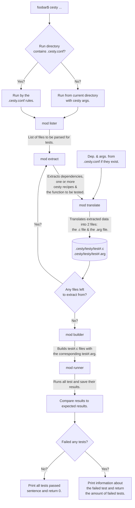
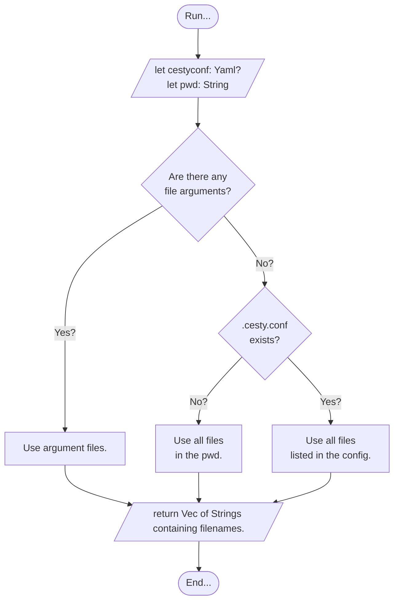
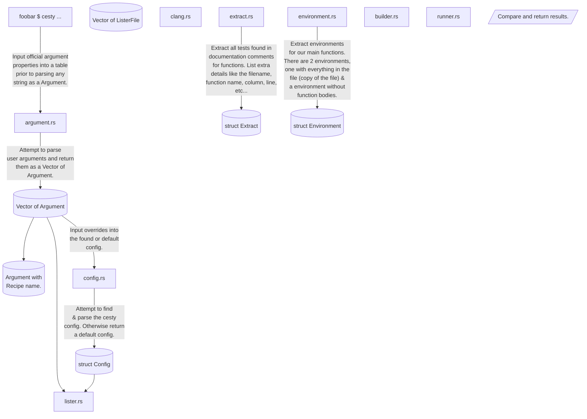

# *cesty*

... is a way to test your C code without adding extra test files or altering your C code directly.

## Concept

Testing doesn't really require alot of functionality.
When you test something you want to run it and expect some value.
*cesty* uses comments to store a testing environment for your functions.

Imagine if we had a function to count the number of words in a string.
If we add the following comment before or inside the function we can run *cesty* on the file of the function and test if our function is doing what we expect it to do:

```yaml
/* #?cesty;
info:
    run: true
    # Function only needs to be explicitly
    # stated when this comment isn't placed
    # before or inside the wordcount() func.
    function: "wordcount()"

test:  
    - ["Laviosa traviosa.", 2, 4]

expect: 
    - 2
*/
```

If we do as the comment says and place it before or inside the function we don't need to state the function name, *cesty* automatically detects the function that is being tested.

```yaml
/* #?cesty;
info: 
    run: true
test:  
    - ["Laviosa traviosa.", 2, 4, 11.5]
expect: 
    - 2
*/
```

```sh
[foo@bar ~/test]$ cesty -pl -f "./wordcount.c"
Conducting tests from file "./wordcount.c":
Available tests:
    File: ./wordcount.c
        Name: wordcount()
            Run: true
        
Running tests:
 >> ./wordcount.c
     >> wordcount():
         >> 1. Test:
                Result: 2
                Expected: 2
         << Passed (Test.1)

        Result: 1/1
     << Passed (wordcount())

    Result: 1/1
 << Passed (./wordcount.c)

Result:
    Files passed: 1/1
    Tests passed: 1/1

Passed, nothing to comment on.
```

And like that, we can run a simple test of our function, without creating a new file, writing `int main() ...`, manually compiling and checking the result.

In the bash shell we passed a `-pl` parameter which makes *cesty* print almost every step along the way. Without the parameter, the output would be much shorter.

```sh
[foo@bar ~/test]$ cesty -f "./wordcount.c"
Passed, nothing to comment on.
```

This is the most simplest form of *cesty*.

The comment begins with `#?cesty;` which is a indicator that the comment contains a *cesty* script.

In the `info:` section we can set `run` if we want this script to run when *cesty* is ran. `function` is only important when we write the comment NOT before the function or inside of it, otherwise it detects what function to test naturally.

In the `io:` section we can set all the children of `input:` which will be the arguments passed to the function being tested. For the current function there is only one argument and it is *str*. `expect`'s value will be the expected value from the passed arguments. `expect` can be used when one test is conducted, otherwise we use the `output:` section. In the same way we can use `argument` instead of `input:` if there is only one argument to pass.

By now you would have understood that the *cesty* "scripting" uses tabs instead of {...}, < />, etc.

Mostly because the nature of the scripting language is only to test and braces would only make it needlessly complex to read and write.

In some cases simply running one test won't be enough. While there are in house ways to do it with *cesty* (more on that later), there are ways to write **C** code for your tests.

The following example:

```yaml
/* #?cesty;
info: 
    run: true

test:
    - name: testy
      input: ["Mouse pouse douse spouse"]
      expect: 4
    
    - ["hello world!"]

    - input: -pm -am # Converted to argv if
      # we are using yaml key "code:".
      code: |
        int tests = 7;
        char *str[tests] = {
            "Lorem opsorem", 
            "Poni Toni Honey Sconey", 
            "", 
            "    ", 
            "\t\t\t\t", 
            "\n\n\n\n", 
            "a\nbb\n\n\n22 3 s\t00\tsdk\n"
            "haaas\n\ndas waz\t\t\traz"
            "ea\tyeay.\n\n"
        };
        int expect[tests] = 
            { 2, 4, 0, 0, 0, 0, 13 };
        int expmet = 0;
        for(int i = 0; i < tests; i++)
            if(expect[i] == wordcount(str[i]))
                expmet++;
        if(expmet == tests)
            return true;   
        return false;

expect:
    - 2
    - true
*/
```

In this test we have named test and nameless test, we can mix and match them if we want to but for the sake of readability i'd recommend sticking to one for the current script.

With named tests there are 4 keys, in which two are optional.

- `name:` name of the test, optional value.
- `input:` if a `code:` is included in the named test then this value acts as a command line argument that can be read by the `code:` function, otherwise it is the arguments of the function being tested.
- `expect:` expected value to be return by either the function or `code:`.
- `code:` a piece of code written in C to test the function, optional value.

From where *cesty* is called by default all files are listed through for tests.

For global settings, recipes, additional file extensions to check, etc... we use the `.cesty.conf` file.

```yaml
# Default values:
cesty:
    flags: -pm
    filetypes:
        - .c
        - .h
    metadata:
        use: true
        output: ".cesty.metadata"
    userdata:
        use: false
        output: "cesty.data"

# By default "gcc" is the compiler.
# Flags
compiler:
    name: clang
    flags: >
        -fblocks -std=c11 -Wall 
         -Wextra -Wpedantic
         -Wformat=2 -Wno-unused-parameter 
         -Wshadow -Wwrite-strings 
         -Wstrict-prototypes     
         -Wold-style-definition 
         -Wredundant-decls -Wnested-externs
         -Wmissing-include-dirs -pipe 
         -Wno-unused-command-line-argument
    libraries: >
        -lm -lncursesw -lBlocksRuntime
         ./ext/viwerr/viwerr.a
         ./ext/PDCurses/wincon/pdcurses.a

recipe:
    name: src
    run:
        - ./src
    force: false

recipe:
    name: all
    run: 
        - ./
    recursive: true
    force: true
```

```shell
[foo@bar ~/test]$ cesty src
[foo@bar ~/test]$ cesty all
[foo@bar ~/test]$ cesty -f ./src/file1.c
```

```yaml
/* #?cesty;
info:
    # Can cesty just plop in a main() into the
    # source file?
    # If `true` main just gets plopped in and 
    # compiler.name compiles the program.
    # If `false` this means that the object file
    # of this source file is included in the 
    # compiler.libraries string so the file gets
    # scraped of code blocks and only declarations
    # and preprocessor commands remains. 
    # This is so that the compiler has a
    # clean slate to work on without getting
    # double references to the same function while
    # compiling.

    # TL;DR is the object file included in the
    # compiler.libraries string? If so set to false,
    # otherwise true.
    # Default is false.
    standalone: true
    # Emit warnings.
    warn: true
    # Turn test on or off.
    run: true

test:
    - name: testy               # Name of the test (optional)
      input: --peepee --poopoo  # argv input (optional)
      code: >                   # Code to be executed
        return true; 
      expect: true              # Expected output of test{code}
    
    - input: -pm -am # Converted to argv if
      # we are using yaml key "code:".
      code: >
        int tests = 7;
        char *str[tests] = {
            "Lorem opsorem", 
            "Poni Toni Honey Sconey", 
            "", 
            "    ", 
            "\t\t\t\t", 
            "\n\n\n\n", 
            "a\nbb\n\n\n22 3 s\t00\tsdk\n"
            "haaas\n\ndas waz\t\t\traz"
            "ea\tyeay.\n\n"
        };
        int expect[tests] = 
            { 2, 4, 0, 0, 0, 0, 13 };
        int expmet = 0;
        for(int i = 0; i < tests; i++)
            if(expect[i] == wordcount(str[i]))
                expmet++;
        if(expmet == tests)
            return true;   
        return false;
      expect: true

# Default value, takes all .o 
# objects in the current working folder
# and includes them in the 
objects:
    - $(PATH)/*.o


# execute: contains a list of commands to run
# before cesty starts creating & compiling tests.
# Primary use is to create the .o object files
# that are used in the cesty compilation.
execute:
    - make -C ".."

# What compiler to use and 
compiler:
    priority:
        name: override
        flags: append
        libraries: ignore
    name: clang
    flags: >
        -fblocks -std=c11 -Wall 
         -Wextra -Wpedantic
         -Wformat=2 -Wno-unused-parameter 
         -Wshadow -Wwrite-strings 
         -Wstrict-prototypes     
         -Wold-style-definition 
         -Wredundant-decls -Wnested-externs
         -Wmissing-include-dirs -pipe 
    libraries: >
        -lm -lncursesw -lBlocksRuntime
         ./ext/viwerr/viwerr.a
         ./ext/PDCurses/wincon/pdcurses.a
    # objects: >
    #     -

*/
```


## How `cesty` works V1



### `mod lister;`



## How `cesty` works V2


    lister-->|Try to create a list of all
    files to be parsed for cesty test comments.
    From recipe defined in the config that is
    mentioned in the arguments and/or files
    listed through arguments.|file_database-->|Done for each
    individual ListerFile.|clang-->|Using libclang parse
    a file pointed inside of
    ListerFile into a AST.|extract & environment

    environment_database & extract_database & recipe & config_database-->builder-->|Creates a new file for
    each test found in Extract for
    all ListerFile's. All files contain
    a comment at the start for a way
    to create their executable &
    the test code.|runner-->|Runs all the tests and saves
    the results.|finish