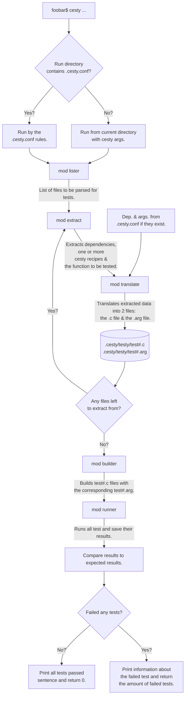
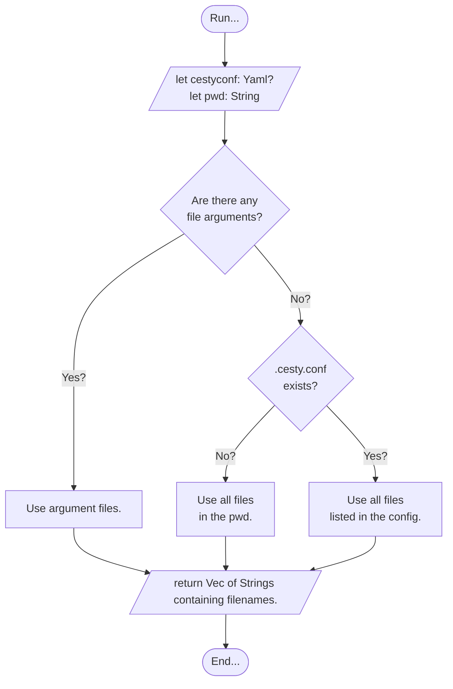
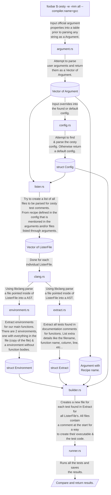

# *cesty*

... is a way to test your C code without adding extra test files or altering your C code directly.

## Concept

Testing doesn't really require alot of functionality.
When you test something you want to run it and expect some value.
*cesty* uses comments to store a testing environment for your functions.

Imagine if we had a function to count the number of words in a string.
If we add the following comment before or inside the function we can run *cesty* on the file of the function and test if our function is doing what we expect it to do:

```yaml
/* #?cesty;
info:
    run: true
    # Function only needs to be explicitly
    # stated when this comment isn't placed
    # before or inside the wordcount() func.
    function: "wordcount()"

test:  
    - ["Laviosa traviosa.", 2, 4]

expect: 
    - 2
*/
```

If we do as the comment says and place it before or inside the function we don't need to state the function name, *cesty* automatically detects the function that is being tested.

```yaml
/* #?cesty;
info: 
    run: true
test:  
    - ["Laviosa traviosa.", 2, 4, 11.5]
expect: 
    - 2
*/
```

```sh
[foo@bar ~/test]$ cesty -pl -f "./wordcount.c"
Conducting tests from file "./wordcount.c":
Available tests:
    File: ./wordcount.c
        Name: wordcount()
            Run: true
        
Running tests:
 >> ./wordcount.c
     >> wordcount():
         >> 1. Test:
                Result: 2
                Expected: 2
         << Passed (Test.1)

        Result: 1/1
     << Passed (wordcount())

    Result: 1/1
 << Passed (./wordcount.c)

Result:
    Files passed: 1/1
    Tests passed: 1/1

Passed, nothing to comment on.
```

And like that, we can run a simple test of our function, without creating a new file, writing `int main() ...`, manually compiling and checking the result.

In the bash shell we passed a `-pl` parameter which makes *cesty* print almost every step along the way. Without the parameter, the output would be much shorter.

```sh
[foo@bar ~/test]$ cesty -f "./wordcount.c"
Passed, nothing to comment on.
```

This is the most simplest form of *cesty*.

The comment begins with `#?cesty;` which is a indicator that the comment contains a *cesty* script.

In the `info:` section we can set `run` if we want this script to run when *cesty* is ran. `function` is only important when we write the comment NOT before the function or inside of it, otherwise it detects what function to test naturally.

In the `io:` section we can set all the children of `input:` which will be the arguments passed to the function being tested. For the current function there is only one argument and it is *str*. `expect`'s value will be the expected value from the passed arguments. `expect` can be used when one test is conducted, otherwise we use the `output:` section. In the same way we can use `argument` instead of `input:` if there is only one argument to pass.

By now you would have understood that the *cesty* "scripting" uses tabs instead of {...}, < />, etc.

Mostly because the nature of the scripting language is only to test and braces would only make it needlessly complex to read and write.

In some cases simply running one test won't be enough. While there are in house ways to do it with *cesty* (more on that later), there are ways to write **C** code for your tests.

The following example:

```yaml
/* #?cesty;
info: 
    run: true

test:
    - name: testy
      input: ["Mouse pouse douse spouse"]
      expect: 4
    
    - ["hello world!"]

    - input: -pm -am # Converted to argv if
      # we are using yaml key "code:".
      code: |
        int tests = 7;
        char *str[tests] = {
            "Lorem opsorem", 
            "Poni Toni Honey Sconey", 
            "", 
            "    ", 
            "\t\t\t\t", 
            "\n\n\n\n", 
            "a\nbb\n\n\n22 3 s\t00\tsdk\n"
            "haaas\n\ndas waz\t\t\traz"
            "ea\tyeay.\n\n"
        };
        int expect[tests] = 
            { 2, 4, 0, 0, 0, 0, 13 };
        int expmet = 0;
        for(int i = 0; i < tests; i++)
            if(expect[i] == wordcount(str[i]))
                expmet++;
        if(expmet == tests)
            return true;   
        return false;

expect:
    - 2
    - true
*/
```

In this test we have named test and nameless test, we can mix and match them if we want to but for the sake of readability i'd recommend sticking to one for the current script.

With named tests there are 4 keys, in which two are optional.

- `name:` name of the test, optional value.
- `input:` if a `code:` is included in the named test then this value acts as a command line argument that can be read by the `code:` function, otherwise it is the arguments of the function being tested.
- `expect:` expected value to be return by either the function or `code:`.
- `code:` a piece of code written in C to test the function, optional value.

From where *cesty* is called by default all files are listed through for tests.

For global settings, recipes, additional file extensions to check, etc... we use the `.cesty.conf` file.

```yaml
# Default values:
cesty:
    flags: -pm
    filetypes:
        - .c
        - .h
    metadata:
        use: true
        output: ".cesty.metadata"
    userdata:
        use: false
        output: "cesty.data"

# By default "gcc" is the compiler.
# Flags
compiler:
    name: clang
    flags: >
        -fblocks -std=c11 -Wall 
         -Wextra -Wpedantic
         -Wformat=2 -Wno-unused-parameter 
         -Wshadow -Wwrite-strings 
         -Wstrict-prototypes     
         -Wold-style-definition 
         -Wredundant-decls -Wnested-externs
         -Wmissing-include-dirs -pipe 
         -Wno-unused-command-line-argument
    libraries: >
        -lm -lncursesw -lBlocksRuntime
         ./ext/viwerr/viwerr.a
         ./ext/PDCurses/wincon/pdcurses.a

recipe:
    name: src
    run:
        - ./src
    force: false

recipe:
    name: all
    run: 
        - ./
    recursive: true
    force: true
```

```shell
[foo@bar ~/test]$ cesty src
[foo@bar ~/test]$ cesty all
[foo@bar ~/test]$ cesty -f ./src/file1.c
```

```yaml
/* #?cesty;
info:
    # Can cesty just plop in a main() into the
    # source file?
    # If `true` main just gets plopped in and 
    # compiler.name compiles the program.
    # If `false` this means that the object file
    # of this source file is included in the 
    # compiler.libraries string so the file gets
    # scraped of code blocks and only declarations
    # and preprocessor commands remains. 
    # This is so that the compiler has a
    # clean slate to work on without getting
    # double references to the same function while
    # compiling.

    # TL;DR is the object file included in the
    # compiler.libraries string? If so set to false,
    # otherwise true.
    # Default is false.
    standalone: true
    # Emit warnings.
    warn: true
    # Turn test on or off.
    run: true

test:
    - name: testy               # Name of the test (optional)
      input: --peepee --poopoo  # argv input (optional)
      code: >                   # Code to be executed
        return true; 
      expect: true              # Expected output of test{code}
    
    - input: -pm -am # Converted to argv if
      # we are using yaml key "code:".
      code: >
        int tests = 7;
        char *str[tests] = {
            "Lorem opsorem", 
            "Poni Toni Honey Sconey", 
            "", 
            "    ", 
            "\t\t\t\t", 
            "\n\n\n\n", 
            "a\nbb\n\n\n22 3 s\t00\tsdk\n"
            "haaas\n\ndas waz\t\t\traz"
            "ea\tyeay.\n\n"
        };
        int expect[tests] = 
            { 2, 4, 0, 0, 0, 0, 13 };
        int expmet = 0;
        for(int i = 0; i < tests; i++)
            if(expect[i] == wordcount(str[i]))
                expmet++;
        if(expmet == tests)
            return true;   
        return false;
      expect: true

# Default value, takes all .o 
# objects in the current working folder
# and includes them in the 
objects:
    - $(PATH)/*.o


# execute: contains a list of commands to run
# before cesty starts creating & compiling tests.
# Primary use is to create the .o object files
# that are used in the cesty compilation.
execute:
    - make -C ".."

# What compiler to use and 
compiler:
    priority:
        name: override
        flags: append
        libraries: ignore
    name: clang
    flags: >
        -fblocks -std=c11 -Wall 
         -Wextra -Wpedantic
         -Wformat=2 -Wno-unused-parameter 
         -Wshadow -Wwrite-strings 
         -Wstrict-prototypes     
         -Wold-style-definition 
         -Wredundant-decls -Wnested-externs
         -Wmissing-include-dirs -pipe 
    libraries: >
        -lm -lncursesw -lBlocksRuntime
         ./ext/viwerr/viwerr.a
         ./ext/PDCurses/wincon/pdcurses.a
    # objects: >
    #     -

*/
```


## How `cesty` works V1



### `mod lister;`



## How `cesty` works V2



## How `cesty` works V3

We take around 95% of V2, but with a few catches.

- Writing YAML in comments is horrendous, TOML would be a much better choice simply because it doesn't use indentation.

- I've never seen any other C testing utilities, but i should have since writing code inside the comments is top notch shit. Nobody want's to write code inside of comments that might not compile during the tests. Since this library was made to be ran after a successful Make, CMake, Ninja, Meson, etc... why not just create test code and mark it as a test?

   For example this is what the current state of test comments looks:
   ```C
   /**
   * @brief
   * returns a copy of the default book.
   * EXECUTING: file --> function --> num. yaml --> test name
   * <!-- 
   * #!cesty;
   * ---  
   * info:
   *     standalone: true
   *     warn: true
   *     run: false
   * 
   * test:
   *     - name: cool_tests.com
   *       code: |
   *         struct innerbook book = my_book();
   *         if(book.author == BOOK_AUTHOR
   *         && book.name == BOOK_NAME
   *         && book.sold_amount == BOOK_SALES ) {
   *           printf("true\n");
   *           return true;
   *         }
   *         printf("false\n");
   *         return false;
   *       expect: true
   *     - name: cum_grade.test
   *       code: |
   *         struct innerbook book = my_book();
   *         if(book.author == BOOK_AUTHOR
   *         && book.name == BOOK_NAME
   *         && book.sold_amount == BOOK_SALES ) {
   *           printf("true\n");
   *           return true;
   *         }
   *         printf("false\n");
   *         return false;
   *       expect: true
   * 
   * prerun:
   *     - echo "aaaaa
   *     - make lsall
   * 
   * include:
   *     - <assert.h>
   *     - <stdio.h>
   * 
   * compiler:
   *   name: gcc
   *   libraries: 
   *     append: false
   *     new: -lm
   *   flags: 
   *     append: false
   *     new: -std=c11
   * ... 
   * --->
   */
   struct innerbook my_book()
   {
       return (struct innerbook){
           .author = BOOK_AUTHOR,
           .name = BOOK_NAME,
           .sold_amount = BOOK_SALES
       };
   }
   ```
   This is atrocius, if it doesn't look that way to you let me prove that this is hot garbage by showing the new way of writing test comments:
   ```C
   struct innerbook my_book()
   {
       return (struct innerbook){
           .author = BOOK_AUTHOR,
           .name = BOOK_NAME,
           .sold_amount = BOOK_SALES
       };
   }
   /// {cesty}
   /// Check if the book returned is correct.
   ///
   /// #!
   /// [settings]
   /// standalone = true
   /// warn       = true
   /// run        = false
   ///
   /// [settings.output]
   /// stdout = true
   /// stderr = false
   ///
   /// [settings.input]
   /// stdin = true
   ///
   /// [compiler]
   /// name = "gcc"
   /// 
   /// [compiler.append]
   /// libraries = "-lm -lncurses"
   /// 
   /// [[compiler.replace.specific.flag]]
   /// old = "--std=*"
   /// new = "--std=c99"
   /// 
   /// [compiler.replace]
   /// flags = ["--std=c2x", ]
   /// 
   /// [[case]]
   /// name   = "cool_test.com"
   /// input  = [
   ///   {definition = "BOOK_SALES"} # Takes a definiton fromthe file.
   /// ]
   /// output = true
   ///
   /// [[case]]
   /// name   = "white_grade test"
   /// input  = 1
   /// output = false
   bool my_book_test(int sales) {

      struct innerbook book = my_book();
  
      if(book.author      == BOOK_AUTHOR
      && book.name        == BOOK_NAME
      && book.sold_amount == sales ) {
  
          // Only appears if [settings.output.stdout] 
          // is true.
          printf("true\n"); 
          return true;
  
      }
  
      printf("false\n");
      return false;

   }
   ```
   Holy shit is this better, let's list what this "fixes" (makes better):

    1. Writing the test is 1000 times easier since indentaion is pretty annoying due to the comment characters being infront of the markdown.
    2. Test are now 1000 times easier to read since without highlighting unlike YAML, TOML is pretty darn readable.
    3. 2000 times more logical. What was i on when i thought that writing code that runs inside comments with specific indentation (YAML T _ T ) that isn't checked for errors until the last minute was a good idea?
    4. No need for HTML comments to hide the cesty markdown so that Doxygen documentation works.
    5. In tandom with doing a sort of makefile exclusion by modification time (explained later) having `{cesty}` on the first line as the indicator makes parsing comments that are not `cesty` so much faster since it is a simple whitespace skip + string comparison.
   
- The explained later. The way we store test files is something like this.
  ```
  .
  ├ .cesty
  │ └ .testy
  │   ├ foo_14u98u8vusdjfi24014.c
  │   ├ foo_wu89124ej19fakf1234.c
  │   └ bar_39824g1kfdfjsfsdj2k.c
  ├ cesty.yaml
  ├ src
  │ ├ ext
  │ │ └ foo.c (has 2 tests)
  │ └ bar.c (has 1 test)
  ├ makefile
  └ lib.h
  ```
  The `.cesty/testy` folder is one folder that holds all the tests. And the issue with that is that we don't know which file holds what test if we have multiple tests from the same file.

  Instead of a one folder soultion recreating the original folder hiearchy will make it so that each file doesn't need a randomized string to make itself unique.
  ```
  .
  ├ .cesty
  │ └ .testy
  │   ├ ext 
  │   │ ├ foo_<function_name>_<test_name>.c
  │   │ └ foo_<function_name>_<test_name>.c
  │   └ bar_<function_name>_<test_name>.c
  ├ cesty.yaml
  ├ src
  │ ├ ext
  │ │ └ foo.c (has 2 tests)
  │ └ bar.c (has 1 test)
  ├ makefile
  └ lib.h
  ```
  This ensures that we can check the modification time of the 
  `.o` file and rerun the tests if the modification time is bigger than the modification time of our `.out` file.

  And due to how makefiles work, if one file is dependant on another it will be recompiled and relinked and therefore modified. This ensures that tests will run on the files that depend on the modified file.

Thats all folks! Heres the new way of making tests without me writing one hundred lines of markdown for the test to list everything you can do.
```C
struct innerbook my_book() {

    return (struct innerbook){
        .author = BOOK_AUTHOR,
        .name = BOOK_NAME,
        .sold_amount = BOOK_SALES
    };

}

/// [compiler]
/// name = "clang"
///
/// [[test]]
/// name   = "Pass."
/// input  = {definition = "BOOK_SALES"}
/// output = true
///
/// [[test]]
/// name   = "Fail."
/// desc   = "Purposefull fail."
/// input  = 1
/// output = false
bool cesty_testy_my_book(int sales) {

    struct innerbook book = my_book();

    if(book.author      == BOOK_AUTHOR
    && book.name        == BOOK_NAME
    && book.sold_amount == sales ) {

        // Only appears if [settings.output.stdout] 
        // is true.
        printf("true\n"); 
        return true;

    }

    printf("false\n");
    return false;

}
```

```C
#include <stdio.h>
#include <stdarg.h>

int _sum(size_t x, va_list list) {

    int s = 0;
    for(size_t i = 0; i < x; i++) {
        s += va_arg(list, int);
    }

    return s;

}

int sum(size_t x, ...) {

    va_list list = va_start(list, x);
    int s = _sum(x, list);
    va_end(list);
    return s;

}

/// [compiler]
/// name = "gcc"
/// 
/// [test]
/// description = "Test if sums line up."
/// # Default behavior is to expect true on a success test.
bool cesty_testy_sum_0() {

    int x = sum(5, 1, 2, 3, 4, 5);    
    if(x != 15) {
        printf(
            "Failed sum(5, 1, 2, 3, 4, 5). "
            "Expected 15. ",
            "Returned %d. ",
            x
        );
        return false;
    }
    return true;

}

/// [compiler]
/// name = "gcc"
/// 
/// [test]
/// input = [
///     5, 
///     {va_list = [1, 2, 3, 4, 5]}
/// ]
/// expect = 15
bool cesty_testy_sum_1(int i, va_list list) {

    return _sum(5, list);

}

/// [compiler]
/// name = "gcc"
/// 
/// [[test]]
/// name = "1. sum test"
/// input = [5, 1, 2, 3, 4, 5]
/// expect = 15
///
/// [[test]]
/// name = "2. sum test"
/// input = [4, -4, 4, -4, 4]
/// expect = 0
int cesty_testy_sum_2(int i, ...) {

    va_list list;
    va_start(list, x);
    int s = _sum(x, list);
    va_end(list);
    return s;

}
```

There is a preriquiste that i neglected to mention. To even begin testing cesty has to have the knowledge of how to compile the code (prerun), and how to include the test code inside the tests themselves.

This only applies to tests that are not "standalone". "standalone" tests are tests whose contained code is contained inside the file itself (or more included files) that can be compiled by cesty iteself and ran without the need of the 2 preriquisets.

